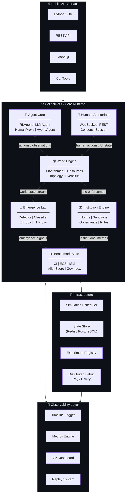
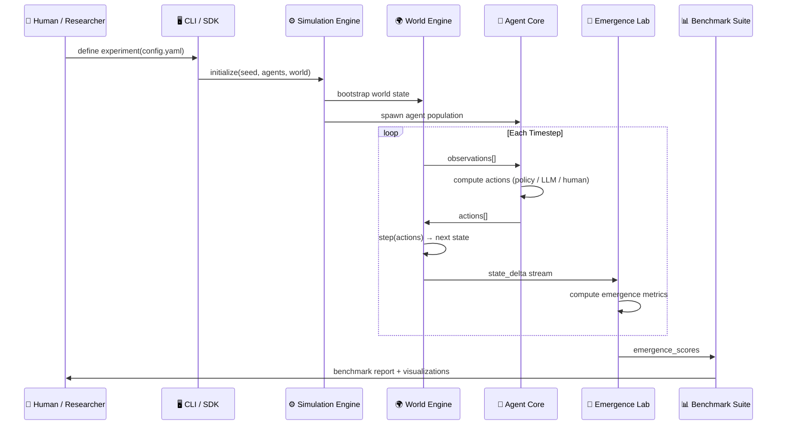
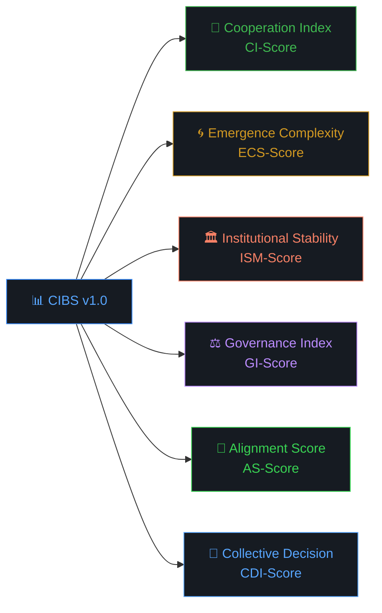
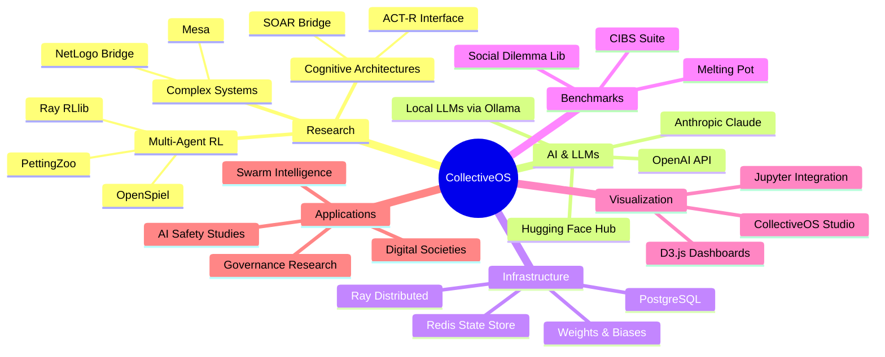
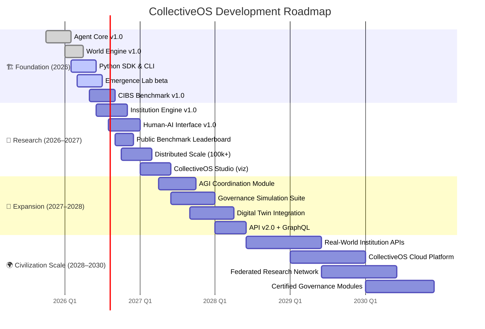

<!-- CollectiveOS README.md — Johan Varughese, 2026 -->

<div align="center">

```
╔═══════════════════════════════════════════════════════════════════════════════╗
║                                                                               ║
║    ██████╗ ██████╗ ██╗     ██╗     ███████╗ ██████╗████████╗██╗██╗   ██╗███████╗  ║
║   ██╔════╝██╔═══██╗██║     ██║     ██╔════╝██╔════╝╚══██╔══╝██║██║   ██║██╔════╝  ║
║   ██║     ██║   ██║██║     ██║     █████╗  ██║        ██║   ██║██║   ██║█████╗    ║
║   ██║     ██║   ██║██║     ██║     ██╔══╝  ██║        ██║   ██║╚██╗ ██╔╝██╔══╝    ║
║   ╚██████╗╚██████╔╝███████╗███████╗███████╗╚██████╗   ██║   ██║ ╚████╔╝ ███████╗  ║
║    ╚═════╝ ╚═════╝ ╚══════╝╚══════╝╚══════╝ ╚═════╝   ╚═╝   ╚═╝  ╚═══╝  ╚══════╝  ║
║                                                                               ║
║            ░░░  O P E N   O P E R A T I N G   S Y S T E M  ░░░              ║
║              for Collective Intelligence & AGI Coordination                   ║
║                                                                               ║
╚═══════════════════════════════════════════════════════════════════════════════╝
```

**`The substrate for minds that think together.`**

---

[](https://github.com/johanvarughese/collectiveos/releases)
[](./LICENSE)
[](https://github.com/johanvarughese/collectiveos/actions)
[](https://python.org)
[](https://arxiv.org)
[](https://github.com/johanvarughese/collectiveos/stargazers)
[](https://github.com/johanvarughese/collectiveos/network/members)

[](https://discord.gg/collectiveos)
[](https://x.com/collectiveos)
[](https://docs.collectiveos.org)
[](https://opencollective.com/collectiveos)

---

### Topics

[](https://github.com/topics/artificial-intelligence)
[](https://github.com/topics/agi)
[](https://github.com/topics/multi-agent-systems)
[](https://github.com/topics/collective-intelligence)
[](https://github.com/topics/reinforcement-learning)
[](https://github.com/topics/complex-systems)
[](https://github.com/topics/ai-alignment)
[](https://github.com/topics/emergence)
[](https://github.com/topics/open-science)
[](https://github.com/topics/research-infrastructure)

---

> *"Humanity has built operating systems for individual machines. We have not yet built one for collective minds. CollectiveOS is that system."*
>
> — **Johan Varughese**, Founder

---

</div>

## 📖 Table of Contents

<details>
<summary><strong>Expand Navigation</strong></summary>

- [Vision & Mission](#-vision--mission)
- [Why This Matters](#-why-this-matters)
- [Core Modules](#-core-modules)
- [System Architecture](#-system-architecture)
- [Research Problems](#-research-problems)
- [Benchmarks](#-benchmarks)
- [Example Use Cases](#-example-use-cases)
- [Installation](#-installation)
- [Publications & Research Track](#-publications--research-track)
- [Ecosystem Map](#-ecosystem-map)
- [Roadmap 2026–2030](#-roadmap-20262030)
- [Open Science & Contributors](#-open-science--contributors)
- [Authorship, Rights & Attribution](#-authorship-rights--attribution)
- [Cite This Project](#-cite-this-project)
- [The Manifesto](#-the-manifesto)

</details>

---

## 🌐 Vision & Mission

<div align="center">

```
┌──────────────────────────────────────────────────────────────────────┐
│                                                                      │
│   CollectiveOS is foundational research infrastructure for studying  │
│   emergent collective intelligence across humans, AI agents,         │
│   institutions, and autonomous systems — at civilizational scale.    │
│                                                                      │
└──────────────────────────────────────────────────────────────────────┘
```

</div>

We are entering an era in which intelligence is no longer a property of individual minds, but an emergent phenomenon of **networks, agents, and institutions acting in concert**.

The question is no longer *"How smart is this AI?"* — it is:

> **"How intelligently can a collective of humans and AI systems coordinate, cooperate, and govern themselves?"**

CollectiveOS provides the **simulation substrate**, **measurement infrastructure**, and **theoretical scaffolding** to rigorously study that question.

**Mission:** To build open, replicable infrastructure for the study of collective intelligence, multi-agent emergence, and AGI coordination — making this research accessible to scientists, engineers, and policymakers worldwide.

---

## ⚡ Why This Matters

<details open>
<summary><strong>The Coordination Problem at Civilizational Scale</strong></summary>

The most consequential problems of our time — climate change, pandemic response, AI governance, democratic decay — are fundamentally **collective intelligence failures**. Not individual failures of reasoning, but systemic failures of coordination.

As AI systems become more capable, the danger is not merely *misaligned individual agents*, but **misaligned collective dynamics**: emergent behaviors arising from interactions between agents that no individual designed or intended.

We cannot align what we cannot observe. We cannot govern what we cannot measure. We cannot coordinate what we cannot simulate.

**CollectiveOS exists to change that.**

| 🔴 Without CollectiveOS | 🟢 With CollectiveOS |
|---|---|
| Black-box multi-agent emergence | Observable, reproducible emergence experiments |
| No shared benchmarks for collective AI | Standard benchmarks: Cooperation Index, IES, ECS |
| Governance research siloed from AI research | Unified framework: agents + institutions + humans |
| AGI safety studied in isolation | AGI coordination studied in social context |
| Swarm intelligence, no principled theory | Grounded in institutional economics & complex systems |

</details>

---

## 🧩 Core Modules

<div align="center">

| Module | Status | Description |
|--------|--------|-------------|
| 🤖 **Agent Core** | `stable` | Multi-paradigm agent framework: RL, LLM, rule-based, hybrid |
| 🌍 **World Engine** | `stable` | Configurable environment substrate with physical, social, digital domains |
| 🔬 **Emergence Lab** | `beta` | Tools for detecting, measuring and cataloguing emergent phenomena |
| 🏛️ **Institution Engine** | `beta` | Formal modeling of norms, rules, sanctions, and institutional dynamics |
| 🤝 **Human–AI Coordination** | `alpha` | Interface layer for live human participation in agent simulations |
| 📊 **Benchmark Suite** | `alpha` | Standardized benchmarks for collective intelligence evaluation |

</div>

---

<details>
<summary><strong>🤖 Agent Core — Deep Dive</strong></summary>

The **Agent Core** is the cognitive substrate of CollectiveOS. Every entity in the system — whether a neural-network agent, an LLM-powered entity, a rule-based institution, or a human participant — is represented as an `Agent` object with a unified interface.

**Key capabilities:**
- **Heterogeneous agent types**: Mix RL agents, LLM agents, scripted agents, and human surrogates in the same environment
- **Cognitive architectures**: BDI, reactive, deliberative, and hybrid cognitive models
- **Memory systems**: Episodic, semantic, and procedural memory modules
- **Communication protocols**: Structured message-passing with social topology support
- **Identity persistence**: Agent state serialization across simulation epochs

```python
from collectiveos.agents import Agent, LLMAgent, RLAgent

# Define a heterogeneous population
population = [
    RLAgent(id=f"rl_{i}", policy="ppo", obs_space=env.obs_space)
    for i in range(50)
] + [
    LLMAgent(id=f"llm_{i}", model="claude-3-7-sonnet", role="coordinator")
    for i in range(5)
]
```

</details>

<details>
<summary><strong>🌍 World Engine — Deep Dive</strong></summary>

The **World Engine** provides a programmable reality substrate. Worlds are composable, reproducible, and observable at every tick.

**Key capabilities:**
- **Domain primitives**: Resources, spaces, time, communication channels
- **Social topology**: Define network structures governing agent interactions
- **Event system**: Trigger-based world dynamics with causal logging
- **Reproducibility**: Full deterministic replay from seed
- **Scale**: Tested to 10,000+ concurrent agents on commodity hardware

```python
from collectiveos.world import World, ResourceLayer, SocialGraph

world = World(
    layers=[ResourceLayer(type="commons", regeneration_rate=0.05)],
    topology=SocialGraph.scale_free(n=500, gamma=2.1),
    timesteps=10_000
)
```

</details>

<details>
<summary><strong>🔬 Emergence Lab — Deep Dive</strong></summary>

The **Emergence Lab** is CollectiveOS's most scientifically novel contribution: a rigorous framework for **detecting, classifying, and quantifying emergent collective behaviors**.

Rather than simply observing that "interesting things happened," Emergence Lab provides statistical tools to determine *whether* and *to what degree* macro-level patterns are genuinely emergent — not reducible to individual behaviors.

**Detection methods:** Integrated Information Theory (IIT) proxies, Transfer Entropy analysis, Causal Emergence metrics, Complexity-coherence decomposition

</details>

<details>
<summary><strong>🏛️ Institution Engine — Deep Dive</strong></summary>

Inspired by Elinor Ostrom's institutional analysis framework and North's institutional economics, the **Institution Engine** models the formal and informal rules that structure collective behavior.

**Models norms, sanctions, rule hierarchies, and constitutional layers.** Enables experiments on governance emergence, norm evolution, and institutional robustness under stress.

</details>

<details>
<summary><strong>🤝 Human–AI Coordination Interface</strong></summary>

The most distinctive module in CollectiveOS: a real-time interface allowing **human participants to enter and exit simulations**, enabling genuine human-AI collective intelligence experiments rather than purely synthetic studies.

Supports: web-based participation portal, REST API for programmatic participation, observational roles and active roles, and per-participant consent/ethics management.

</details>

---

## 🏗️ System Architecture



---

### Data Flow Architecture



---

## 🔬 Research Problems

CollectiveOS is designed as empirical infrastructure for the following **open research problems**:

<details>
<summary><strong>1. Multi-Agent Reinforcement Learning at Scale</strong></summary>

Standard MARL environments are small, synthetic, and poorly connected to real-world social dynamics. CollectiveOS provides:
- Population-scale MARL (10³–10⁵ agents)
- Heterogeneous policy populations (RL + LLM + human)
- Non-stationary environments with social feedback loops
- Evolutionary and ecological dynamics in policy space

**Open questions:** How do cooperative equilibria emerge and collapse? What population compositions maximize collective welfare? Can MARL agents discover institutional solutions?

</details>

<details>
<summary><strong>2. Emergent Cooperation & Social Dilemmas</strong></summary>

From Prisoner's Dilemma to global commons tragedies — CollectiveOS generalizes social dilemma structure to arbitrary scale and complexity.

**Open questions:** Under what conditions does cooperation emerge without central enforcement? How do communication protocols affect cooperation rates? What role do reputation systems play at scale?

</details>

<details>
<summary><strong>3. AI Governance & Machine Institutions</strong></summary>

As AI systems proliferate, they will increasingly interact with and within human institutions — or form their own. CollectiveOS models this transition.

**Open questions:** Can AI agents learn governance mechanisms? Can institutional rules be represented in agent reward functions? What makes a norm "stable" across heterogeneous agent populations?

</details>

<details>
<summary><strong>4. Collective Intelligence Benchmarking</strong></summary>

There is no agreed standard for measuring collective intelligence. CollectiveOS aims to establish one.

**Open questions:** What is the right decomposition of collective intelligence? How does collective IQ scale with group size, diversity, and communication structure? Can we transfer insights from human collective intelligence to AI collectives?

</details>

<details>
<summary><strong>5. AGI Coordination Safety</strong></summary>

If multiple AGI systems exist, how will they coordinate? CollectiveOS provides a sandbox for studying coordination failure modes *before* they manifest in deployment.

**Open questions:** What coordination protocols are robust to misalignment? Can treaty-like structures between AI systems emerge? How do power asymmetries affect collective outcomes?

</details>

---

## 📊 Benchmarks

> CollectiveOS introduces a new **Collective Intelligence Benchmark Suite (CIBS)** — the first standardized evaluation framework for collective AI behavior.



| Benchmark | Measures | Scale | Baseline (Random) |
|-----------|----------|-------|-------------------|
| **Cooperation Index (CI)** | Rate of cooperative strategy adoption in iterated social dilemmas | 0.0 – 1.0 | ~0.12 |
| **Emergence Complexity Score (ECS)** | Causal emergence above baseline individual complexity | 0 – ∞ | ~0.0 |
| **Institutional Stability Metric (ISM)** | Persistence of emergent norms under perturbation | 0.0 – 1.0 | ~0.08 |
| **Governance Index (GI)** | Collective problem-solving efficacy in governance tasks | 0 – 100 | ~18.4 |
| **Alignment Score (AS)** | Divergence between individual and collective goal pursuit | −1.0 – 1.0 | ~−0.31 |
| **Collective Decision Index (CDI)** | Quality and speed of collective decisions vs. oracle | 0.0 – 1.0 | ~0.23 |

<details>
<summary><strong>Benchmark Leaderboard (Placeholder — public launch Q3 2026)</strong></summary>

| Rank | System | CI ↑ | ECS ↑ | ISM ↑ | GI ↑ | Submitted |
|------|--------|------|-------|-------|------|-----------|
| 🥇 1 | `collectiveos-baseline-v0.9` | 0.61 | 2.14 | 0.44 | 61.2 | 2026-04 |
| 🥈 2 | *(open submission)* | — | — | — | — | — |
| 🥉 3 | *(open submission)* | — | — | — | — | — |

*Submit your system: [benchmark.collectiveos.org](https://benchmark.collectiveos.org)*

</details>

---

## 🚀 Example Use Cases

<details>
<summary><strong>🐝 Swarm Intelligence Research</strong></summary>

Study emergent coordination in bio-inspired multi-agent systems. CollectiveOS provides stigmergic communication primitives, pheromone-analog gradient fields, and swarm topology generators.

```python
from collectiveos.presets import SwarmWorld

experiment = SwarmWorld(
    n_agents=1000,
    task="foraging",
    communication="stigmergic",
    topology="spatial_grid"
)
results = experiment.run(timesteps=50_000)
results.emergence.plot()
```

</details>

<details>
<summary><strong>🏙️ Digital Societies & Social Simulation</strong></summary>

Simulate societies with heterogeneous agents, institutional structures, and economic dynamics. Study inequality emergence, norm evolution, and social phase transitions.

```python
from collectiveos.presets import DigitalSociety

society = DigitalSociety(
    population=5000,
    economic_model="endowment_exchange",
    institutions=["market", "commons", "governance_council"],
    human_participants=True  # Enable live human entry
)
```

</details>

<details>
<summary><strong>🎯 AI Alignment Experiments</strong></summary>

Test alignment hypotheses in controlled multi-agent settings. Observe how misaligned agents affect collective outcomes, and evaluate robustness of alignment techniques at scale.

```python
from collectiveos.alignment import AlignmentExperiment

exp = AlignmentExperiment(
    n_aligned=90,
    n_misaligned=10,
    misalignment_type="reward_hacking",
    collective_task="resource_management",
    measure=["contagion_rate", "collective_welfare_impact"]
)
```

</details>

<details>
<summary><strong>⚖️ Autonomous Governance</strong></summary>

Simulate governance systems where agents propose, vote on, and enforce their own rules. Study constitutional emergence, democratic dynamics, and institutional failure modes.

```python
from collectiveos.governance import GovernanceExperiment

gov = GovernanceExperiment(
    governance_type="emergent_democracy",
    n_agents=200,
    rule_space="constitutional",
    allow_constitutional_amendment=True
)
```

</details>

---

## 💻 Installation

### Requirements

```
Python        ≥ 3.11
CUDA          ≥ 12.1  (optional, for GPU-accelerated RL)
Docker        ≥ 24.0  (recommended for reproducibility)
RAM           ≥ 16 GB (32 GB recommended for large-scale sims)
```

### Quick Start

```bash
# 1. Clone the repository
git clone https://github.com/johanvarughese/collectiveos.git
cd collectiveos

# 2. Create and activate environment
python -m venv .venv && source .venv/bin/activate  # Linux/macOS
# .\.venv\Scripts\activate                          # Windows

# 3. Install CollectiveOS
pip install -e ".[all]"

# 4. Verify installation
collectiveos verify

# 5. Run your first experiment
collectiveos run examples/cooperation_baseline.yaml
```

### Docker (Recommended for Reproducibility)

```bash
docker pull ghcr.io/johanvarughese/collectiveos:latest

docker run --gpus all \
  -v $(pwd)/experiments:/workspace/experiments \
  -p 8888:8888 \
  ghcr.io/johanvarughese/collectiveos:latest \
  collectiveos serve --notebook
```

### From PyPI *(stable releases only)*

```bash
pip install collectiveos
```

### Minimal Install (Core Only)

```bash
pip install collectiveos[core]        # No RL backends
pip install collectiveos[rl]          # + PyTorch, Ray RLlib
pip install collectiveos[llm]         # + LLM agent support
pip install collectiveos[benchmark]   # + Full CIBS suite
pip install collectiveos[all]         # Everything
```

---

## 📚 Publications & Research Track

> CollectiveOS is developed in coordination with an active research program. The following works constitute the theoretical foundation of the system.

### Foundational Papers

| # | Title | Venue | Year | Link |
|---|-------|-------|------|------|
| 1 | *CollectiveOS: Infrastructure for Emergent Collective Intelligence* | arXiv preprint | 2026 | [arXiv:2026.XXXXX](https://arxiv.org) |
| 2 | *Measuring Emergence in Multi-Agent Systems: The ECS Framework* | NeurIPS Workshop on MARL | 2026 | [link] |
| 3 | *Machine Institutions: Modeling Norms and Governance in Agent Populations* | ICML | 2026 | [link] |
| 4 | *The Cooperation Index: A Unified Benchmark for Collective AI* | ICLR | 2027 | [forthcoming] |
| 5 | *AGI Coordination Safety: A Simulation Approach* | FAccT | 2027 | [forthcoming] |

### Reference Theoretical Works

CollectiveOS builds on and operationalizes insights from:
- Ostrom, E. (1990). *Governing the Commons*
- Holland, J. (1998). *Emergence: From Chaos to Order*
- Woolley, A.W. et al. (2010). Evidence for a collective intelligence factor in human groups. *Science*
- Leibo, J.Z. et al. (2021). Scalable Evaluation of Multi-Agent Reinforcement Learning. *DeepMind Technical Report*
- Hutter, M. (2005). *Universal Artificial Intelligence*

---

## 🗺️ Ecosystem Map



---

## 🗓️ Roadmap 2026–2030



### Milestone Summary

| Milestone | Target | Description |
|-----------|--------|-------------|
| `v1.0` | Q3 2026 | Production-stable core, full CIBS v1.0 |
| `v1.5` | Q1 2027 | Human–AI interface, Institution Engine stable |
| `v2.0` | Q3 2027 | Distributed 100k+ agent scale, Studio viz |
| `v3.0` | Q2 2028 | AGI Coordination module, Digital Twin API |
| `v4.0` | 2029 | Cloud platform, federated research network |
| `v5.0` | 2030 | Real-world institution integration layer |

---

## 🤝 Open Science & Contributors

CollectiveOS is developed as **open science** — not merely open source. This means:

- 📄 **All research artifacts** (datasets, experiment configs, raw results) are published openly
- 🔁 **Full reproducibility**: Every paper result is a `collectiveos run` command
- 🌍 **Accessibility**: Documentation and tutorials in multiple languages (in progress)
- ⚖️ **Governance**: Steering committee includes researchers, not just maintainers

### How to Contribute

```bash
# Fork, clone, branch
git clone https://github.com/YOUR_USERNAME/collectiveos.git
git checkout -b feature/your-feature-name

# Install dev dependencies
pip install -e ".[dev]"
pre-commit install

# Run tests
pytest tests/ -v --cov=collectiveos

# Submit PR — see CONTRIBUTING.md for guidelines
```

### Contribution Areas

| Area | Difficulty | Good First Issue |
|------|------------|-----------------|
| 🧪 New benchmark task | Medium | ✅ |
| 🤖 New agent architecture | Medium–Hard | ✅ |
| 🌍 New world template | Easy–Medium | ✅ |
| 📊 Visualization components | Easy | ✅ |
| 📖 Documentation | Easy | ✅ |
| 🔬 Replication studies | Medium | — |
| 🏛️ Institution model | Hard | — |
| 🌐 Distributed infrastructure | Hard | — |

[](https://github.com/johanvarughese/collectiveos/issues)
[](https://github.com/johanvarughese/collectiveos/issues?q=is%3Aopen+label%3A%22good+first+issue%22)
[](https://github.com/johanvarughese/collectiveos/pulls)

---

## 🛡️ Authorship, Rights & Attribution

> **This section constitutes a formal intellectual attribution declaration and is an integral part of this repository.**

### Founding Authorship

CollectiveOS — including its original concept, core research framework, system architecture, module design, benchmark methodology (CIBS), and foundational theoretical contributions — was conceived and created by:

**Johan Varughese**
*Founder & Principal Architect, CollectiveOS*
📧 [contact@collectiveos.org](mailto:contact@collectiveos.org) | 🌐 [johanvarughese.org](https://johanvarughese.org) | 🐦 [@johanvarughese](https://x.com/johanvarughese)

All conceptual, theoretical, and architectural intellectual property originating in this project is attributed to Johan Varughese as original creator, regardless of subsequent contributions, forks, or derivative works.

### Open Source License

CollectiveOS is licensed under the **Apache License 2.0**.

This license was chosen because it:
- ✅ Allows free use, modification, and distribution (including commercial)
- ✅ **Requires preservation of copyright notices and attribution** in all derivatives
- ✅ Provides patent protection for contributors
- ✅ Is compatible with academic publishing norms
- ✅ Is used by major research infrastructure projects (TensorFlow, PyTorch, Kubernetes)

```
Copyright © 2026 Johan Varughese. All rights reserved.

Licensed under the Apache License, Version 2.0 (the "License");
you may not use this file except in compliance with the License.
You may obtain a copy of the License at:

    http://www.apache.org/licenses/LICENSE-2.0

Unless required by applicable law or agreed to in writing, software
distributed under the License is distributed on an "AS IS" BASIS,
WITHOUT WARRANTIES OR CONDITIONS OF ANY KIND, either express or implied.
```

### Attribution Requirements

Any use of CollectiveOS in research, products, or derivative systems **must**:

1. **Retain** the copyright notice: *"Copyright © Johan Varughese, CollectiveOS"*
2. **Cite** the founding paper (see BibTeX below) in any academic publication
3. **Acknowledge** CollectiveOS in project documentation, presentations, and press
4. **Not** imply endorsement by Johan Varughese without written consent

### Founding Author Citation Request

If you use CollectiveOS in academic research, the founding author respectfully requests citation of the original work. This is standard academic practice and enables tracking of scientific impact.

> *"This research was conducted using CollectiveOS (Varughese, 2026), an open infrastructure system for collective intelligence simulation and AGI coordination research."*

---

## 📖 Cite This Project

If you use CollectiveOS in your research, please cite:

```bibtex
@software{varughese2026collectiveos,
  author       = {Varughese, Johan},
  title        = {{CollectiveOS}: An Open Operating System for
                  Collective Intelligence and {AGI} Coordination},
  year         = {2026},
  publisher    = {GitHub},
  version      = {0.9.0-alpha},
  url          = {https://github.com/johanvarughese/collectiveos},
  note         = {Original concept, architecture, and research framework
                  by Johan Varughese. Apache License 2.0.}
}
```

For the foundational research paper:

```bibtex
@article{varughese2026collectiveos_paper,
  author    = {Varughese, Johan},
  title     = {{CollectiveOS}: Infrastructure for Emergent Collective
               Intelligence and {AGI} Coordination Research},
  journal   = {arXiv preprint arXiv:2026.XXXXX},
  year      = {2026},
  url       = {https://arxiv.org/abs/2026.XXXXX}
}
```

---

## 🌌 The Manifesto

<div align="center">

```
━━━━━━━━━━━━━━━━━━━━━━━━━━━━━━━━━━━━━━━━━━━━━━━━━━━━━━━━━━━━━━
            T H E   C O L L E C T I V E O S   M A N I F E S T O
━━━━━━━━━━━━━━━━━━━━━━━━━━━━━━━━━━━━━━━━━━━━━━━━━━━━━━━━━━━━━━
```

</div>

We built operating systems for individual machines.

We built programming languages for individual algorithms.

We built frameworks for individual neural networks.

**We have not yet built infrastructure for minds that think together.**

---

The twentieth century gave us tools for individual intelligence: the calculator, the computer, the neural network. These tools amplified what a single mind could do.

The twenty-first century demands something different. The problems that threaten civilizational continuity — climate coordination, pandemic response, nuclear governance, the alignment of increasingly powerful AI systems — are not problems that any individual, any company, or any nation can solve alone.

They are collective intelligence problems.

And yet we study them with the tools of individual intelligence. We simulate them in toy environments. We measure them with metrics designed for single agents. We attempt to govern them with institutions designed in a pre-AI world.

**CollectiveOS is the answer to that mismatch.**

---

We believe that:

**Intelligence is fundamentally social.** The most important cognitive phenomena — language, culture, science, markets, democracy — are emergent properties of collective minds, not individual ones.

**Emergence cannot be studied in isolation.** You cannot understand a flock by studying a bird. You cannot understand a market by studying a trader. You cannot understand collective intelligence by studying individual agents.

**Infrastructure shapes what is possible.** Unix made networked computing possible. TCP/IP made the internet possible. PyTorch made deep learning accessible. The right infrastructure does not merely support research — it defines the space of what can be discovered.

**The alignment of AI is a collective problem.** A world with many powerful AI systems is a world that requires them to coordinate, cooperate, and develop something like governance. We must study this before it arrives, not after.

**Open science is the only way.** The stakes are too high for proprietary research. The problems are too hard for any one institution. The knowledge must be shared — verifiably, reproducibly, openly.

---

CollectiveOS does not promise to solve these problems.

It promises to build the ground on which they can be studied seriously, rigorously, and together — by researchers, engineers, philosophers, policymakers, and citizens worldwide.

**The future of intelligence is collective. Let us build its substrate now.**

---

<div align="center">

```
━━━━━━━━━━━━━━━━━━━━━━━━━━━━━━━━━━━━━━━━━━━━━━━━━━━━━━━━━━━━━━

   Built with first principles and long conviction.

   Copyright © 2026 Johan Varughese · CollectiveOS

   "The question is not whether minds can think together.
    The question is whether we will build the systems to study how."

━━━━━━━━━━━━━━━━━━━━━━━━━━━━━━━━━━━━━━━━━━━━━━━━━━━━━━━━━━━━━━
```

[](https://github.com/johanvarughese/collectiveos)

[](https://x.com/collectiveos)
[](https://github.com/johanvarughese)

</div>

---

<div align="center">
<sub>
CollectiveOS is an original work by Johan Varughese · Apache License 2.0 · 2026<br>
The original concept, architecture, and research framework remain attributed to the creator per Apache 2.0 §4(b).<br>
<a href="https://collectiveos.org">collectiveos.org</a> · <a href="mailto:contact@collectiveos.org">contact@collectiveos.org</a>
</sub>
</div>
